# Brother PT-H110 Label Maker

I'm interested in repurposing this Brother label maker for its keyboard and display. Is it hackable? I guess we'll find out. From @furrtek, we already have a head start: https://github.com/furrtek/PTouchHH. Seems like the microcontroller is pretty much completely locked out. Could bother with double-checking? TBD.


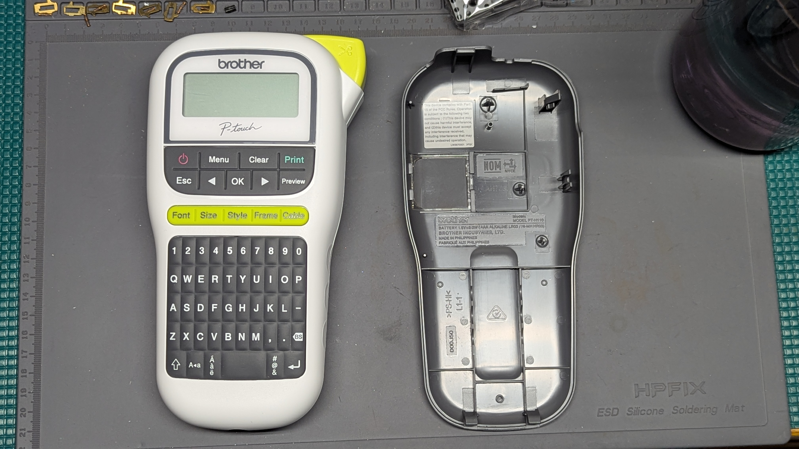
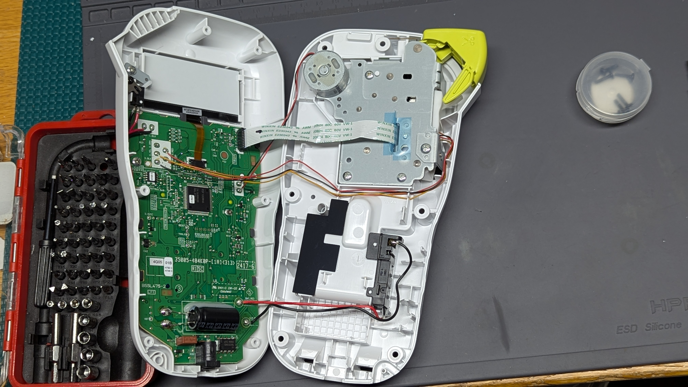

## Main Board


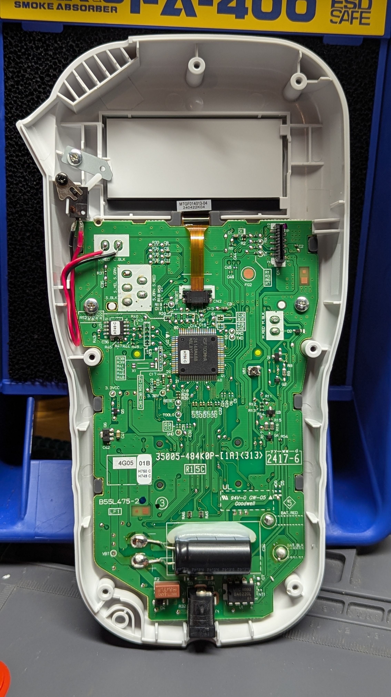

I was able to scan the back of the board since it's flat. I'd need to remove some components from the front to do the same there. Even with the small deviation from flatness at the bottom, the focus goes slightly out in this scan.


## Notable Parts

- [R5F100MHAFB#V0](https://www.mouser.com/datasheet/2/698/r01ds0131ej0370_rl78g13-3083289.pdf) - Renesas - 16-bit microcontroller, 192KB/16KB, in 80LFQFP
- "UTC" 8-DIP chip - Chinese PMIC probably for general power management or battery charging? See e.g. [this forum thread](https://forum.allaboutcircuits.com/threads/datasheet-for-utc-7608d-i-c.187103/) for a similar part
- [W25Q40CL](https://www.mouser.com/datasheet/2/949/w25q40cl_e_07282017-1489768.pdf) - Windbond - 4Mb SPI Flash
- MTG-F014013 - Custom LCD display, guessing about the first dash in the part number, 8-pin connection out. Compare with e.g. the [MTG-E8619](https://www.elecok.com/panel-5-7-inch-320-240-industrial-lcd-display-module-mtg-e8619.html)

The off-chip Flash memory might be a fortunate circumstance, the unit Furrtek analyzed didn't have one. Could also be locked out or a dead end, we'll see.

The microcontroller is one of the 80-pin variety (see p. 41 of datasheet for block diagram).

Something that's going to be interesting: the keyboard being part of the main board means I can't just replace the main board, but will have to piggy-back. Not sure how difficult that's going to be. I'm not that familiar with keyboards and displays, don't really know what to expect.

## Keyboard Matrix

I traced out the keyboard matrix. Whether that was really necessary, who's to say...


The matrix below maps the pins on the main MCU to the 62 buttons (60 keys, since space is actually three buttons). The column represents the top pad, the row represents the bottom pad. For example the `A` key is pin 28 (top) and pin 37 (bottom).

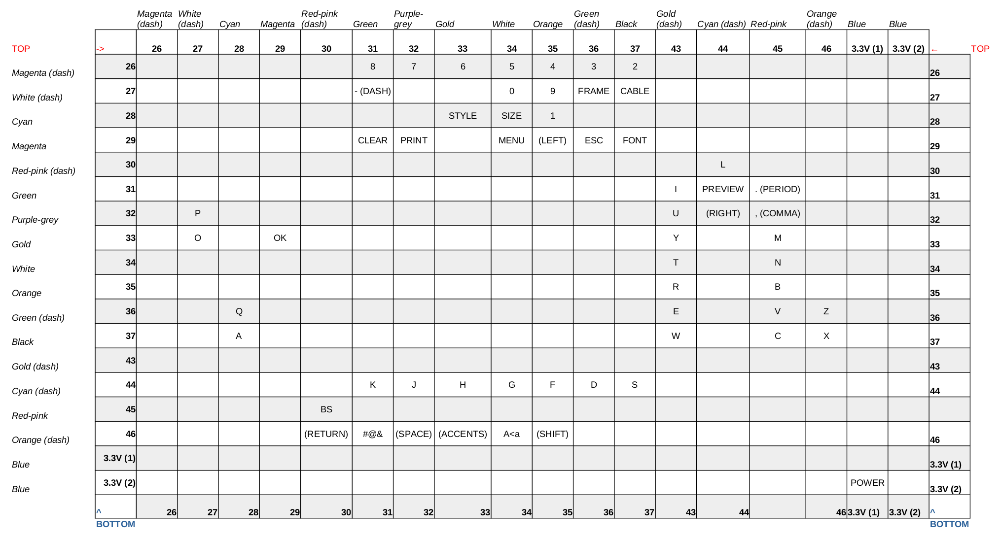


## LCD 

The LCD is custom. A closer look from an online image:

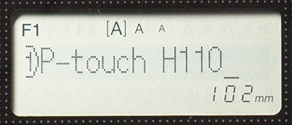

Display is a mixed segment and dot matrix (144 x 16) LCD. There are 8 pins:

| Pin | Description       |
| --- | ----------------- |
| 1   | Backlight, 6.4V   |
| 2   | GND               |
| 3   | 3.3V              |
| 4   | Data              |
| 5   | Clock             |
| 6   | A0 (command/data) |
| 7   | TRESETn           |
| 8   | CS1               |

From looking up similar displays on DigiKey, this display could very well use an ST7565, although the commands seem to be different. The interface is similar enough, though. 

Here's the connections for the logic analyzer. I used some UV-cure epoxy to keep the wires in place. 

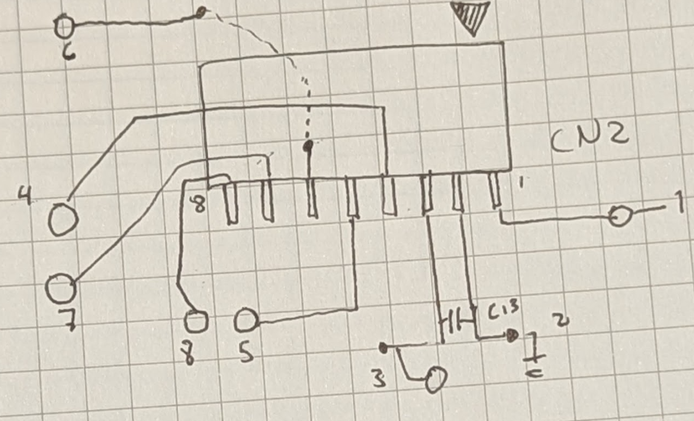

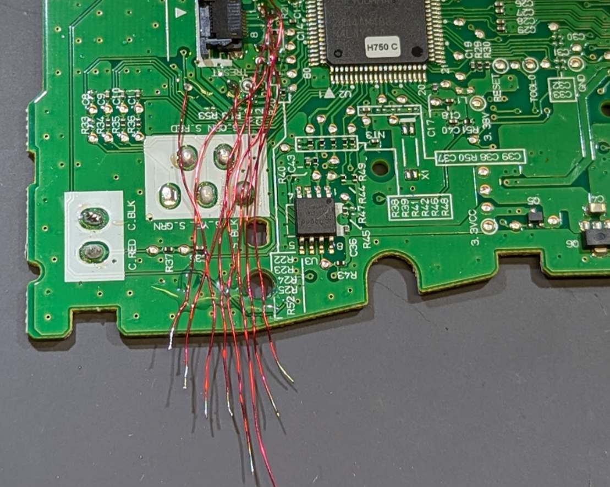

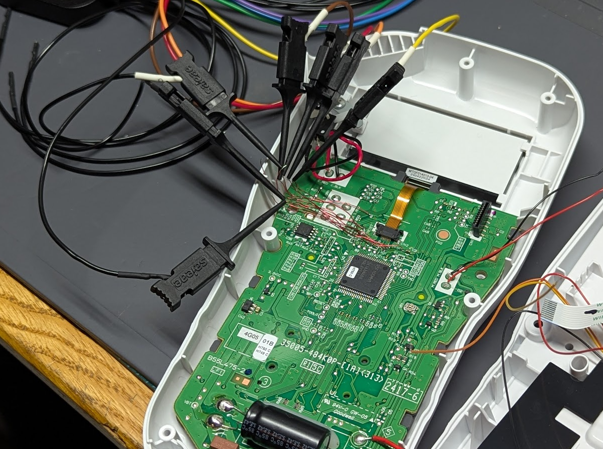


Clock frequency is around 4MHz. Here's an example of pins 4-8 captured with the Saleae at 50Msps:

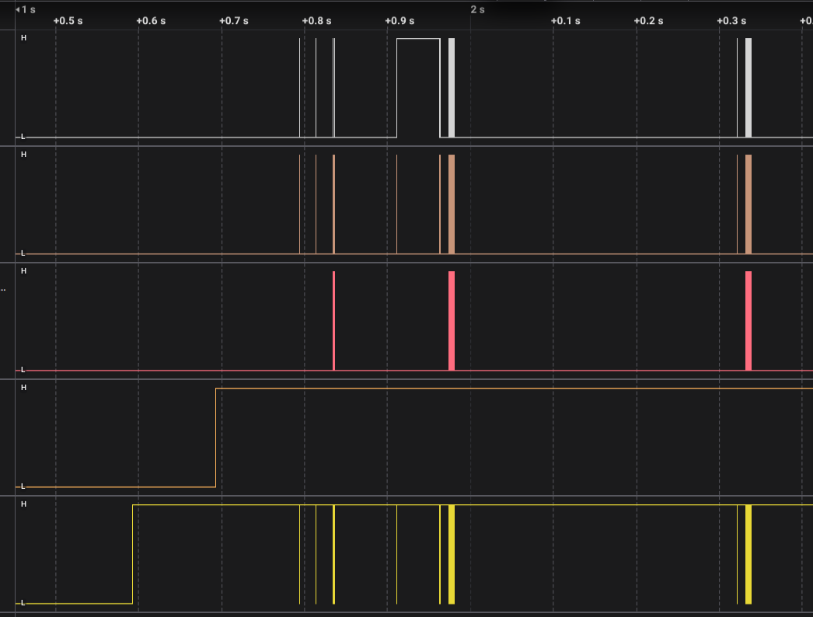

This is SPI communication, MSB first, CPOL=0, CPHA=0, Enable active LOW.

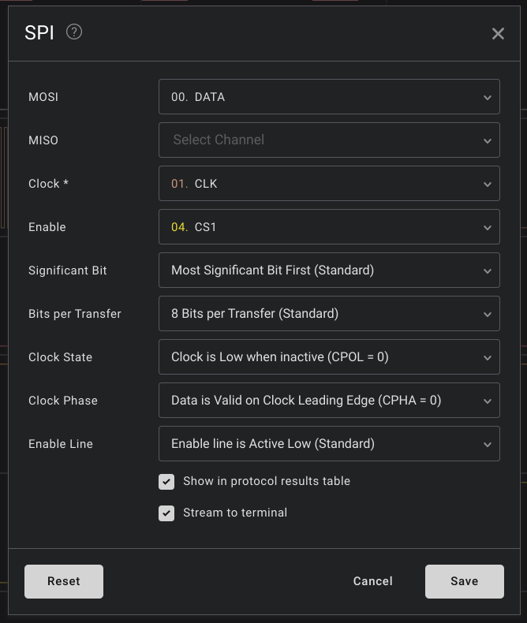

We're not so lucky as to get any ASCII characters. Instead, I found that the dot matrix is written to pixel-by-pixel, raster-style from left to right, written in 8-pixel bytes. Data comes through roughly every 5.68us. To illustrate how this works, I made a capture with the following written on the display:

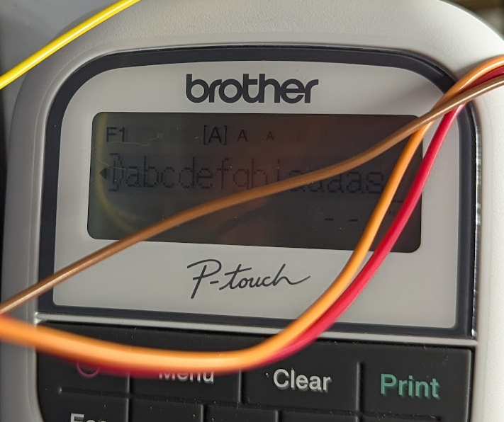

That's `abcdefghiaaaas`. I used this and a lot of tinkering, truncating, and rearranging to determine how the bits map to pixels. 

Before any mapping, here's the result of the `abcdefghiaaaas` capture as hex, reorganized as I learn more about how the communication is working:

```
[setup - 10ms before other data, A0 line stays LOW the whole time]
88 88 88 88 60 E3 3A 2F 34 B1 43 6C 92 A1 B2 22 08

[10ms wait...]

[setup 2 - right before other data, A0 still LOW]
50 40 3D 
[60us wait...] 
10 01 C0

[dot matrix data - A0 now the inverse of CS1]
F000000000000000000000000000000000000800800002000C0080100000000000000000080080000200100080100000000000000000240080000200100080000000000000000000240080000200100080000000000000000000E278B8383A387C3AB810787878787C0000002284C44446441046C4108484848482000000220482808282108282100404040482000000223C828082FE108282103C3C3C3C6000000022448280828010828210444444441C000000248482808280104682108484848482000000248CC4444642103A82108C8C8C8C820000000872B8383A3C10028210727272727C000000080000000000008200000000000000000000F00000000000007C00000000000000000000000000000000000000000000000000FF0000 [length = 288 bytes]

[commands and data - A0 is high or low depending on command or data]
[commands] | [data]
11 01 C0   | 00
11 01 C2   | 00
11 01 C4   | 00
11 01 C4   | 00
11 01 C3   | 00 
11 01 C6   | 00 
11 01 C8   | 00 
11 01 CC   | 80 
11 01 CE   | 21 
11 01 CF   | 04 
11 01 CF   | 04 
11 01 CF   | 04 
11 01 CA   | 00 
11 01 CA   | 00 
11 01 CA   | 00 
11 01 CA   | 00 
11 01 CA   | 00 
11 01 CA   | 00 
11 01 CA   | 00 
11 01 CB   | 00 
11 01 CB   | 00 
11 01 CC   | 80 
11 01 CC   | 80 
11 01 CC   | 80 
11 01 CB   | 00 
11 01 CC   | 80 
11 01 CD   | 02 
11 01 CD   | 02 
11 01 CD   | 02 
11 01 CD   | 02 
11 01 CE   | 21 
11 01 CD   | 02 
11 01 CE   | 21 
11 01 CE   | 21 
11 01 CE   | 21 
11 01 CF   | 04 
11 01 CE   | 21 
11 01 CF   | 04 
11 01 CE   | 21 
11 01 CF   | 04 

10 00 C3   | 00 
10 00 C1   | 00 
10 00 C0   | 42 
10 00 C8   | 00 
10 00 C6   | 00 
10 00 C5   | 60 
10 00 CA   | 00 
10 00 CB   | 00 
10 00 CD   | 00 
10 00 CE   | 00 
10 00 CF   | 00 
10 00 C0   | 42 
10 00 CF   | 00 
10 00 C5   | 60

[340ms wait...]
[repeats]
```

After trying a few different approaches, I found that by taking the bulk data, skipping the first 36 bytes, and plotting it in a 16bit tall dot matrix row-first (so that `F0` maps to the first row, `11110000`) we get something close to correct:

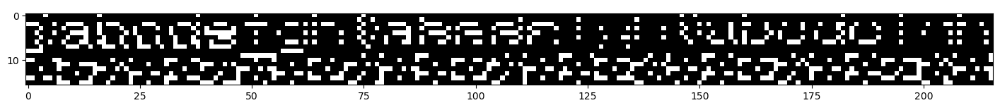

Problems here are because the width is actually 128 \[edit: later found to be 144], so it's more like we're getting lucky by the line offsets, it should wrap at 128 \[144] excluding any segments that get written to, which would be added. So instead, by using the full length of the data, and iterating over line widths, I arrived at 144 columns to reproduce the text:

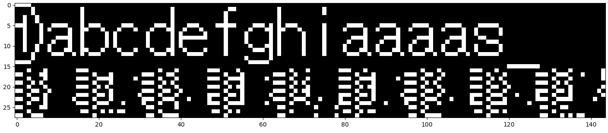

First 16 rows only:

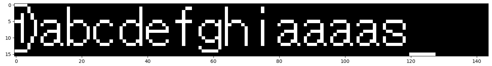

It seems like the dot matrix is actually 144 pixels, unless the remainder are for segments. The other data is corrupted because I realized it's a mix of commands and data, probably controlling the segments. 

### Display Commands and Data

In this part of the capture, we see commands (`A0` does not go HIGH) and data (`A0` is HIGH for the duration). While `A0` is actually latched by the ST7565 (still assuming that's the controller) in the capture it stays HIGH the whole byte. 

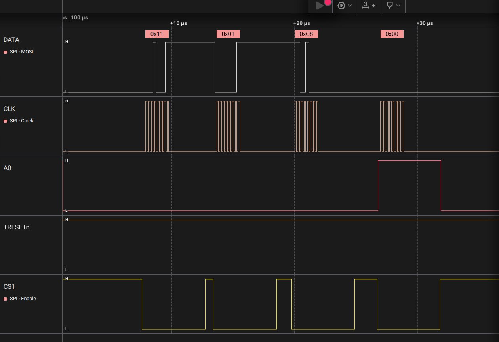

```
11 01 C8    Commands
00          Data
```

Here are the commands relating to display for the ST7565. 

| Command                | Description                                       | ST7565 Byte(s)                                                                                                        |
| ---------------------- | ------------------------------------------------- | --------------------------------------------------------------------------------------------------------------------- |
| Display ON/OFF         |                                                   | `0xAE` OFF<br>`0xAF` ON                                                                                               |
| Display Start Line Set | Set display RAM display start line address        | `0x40 + addr` for 6-bit display start address `addr`                                                                  |
| Page Address Set       | Set display RAM page address                      | `0xB0 + addr` for 4-bit page address `addr`                                                                           |
| Column Address Set     | Set most/least significant column address         | `0x10 + MSA` for most significant column address `MSA`<br>`0x00 + LSA` for least significant column address `LSA`<br> |
| Status Read            | Read status data                                  | `status<<4` for 4-bit `status`                                                                                        |
| Display Data Write     | Write to display RAM                              | data                                                                                                                  |
| Display Data Read      | Read from display RAM                             | data                                                                                                                  |
| ADC Select             | Set display RAM address SEG output correspondence | `0xA0` normal<br>`0xA1` reverse                                                                                       |
| Display Normal/Reverse | Set LCD display normal/reverse                    | `0xA6` normal<br>`0xA7` reverse                                                                                       |
| Read/Modify/Write      | Column address increment                          | `0xE0`                                                                                                                |
| End                    | Clear read/modify/write                           | `0xEE`                                                                                                                |
| Reset                  | Internal reset                                    | `0xE2`                                                                                                                |
| NOP                    | No operation                                      | `0xE3`                                                                                                                |


I'm not sure this really lines up with what I'm seeing. Here's what I can infer about writing data during quiescent operation:

| Command | Address(es)                           | Notes                                    |
| ------- | ------------------------------------- | ---------------------------------------- |
| `10 00` | `C0,C1,C3,C5,C6,C8,CA,CB,CC,CD,CE,CF` | Writing to segments?                     |
| `10 01` | `C0`                                  | Starts a write to the dot matrix display |
| `11 01` | `C0,C2,C3,C4,C6,C8,CA,CB,CC,CD,CE,CF` | Writing to segments?                     |


Many of the "addresses" (assuming that's what they are) are written to several times, the same value each time. 

Anyway, I'm just about done here, I don't need to know the display commands in order to repurpose the display, I can just replay the data. 

### Full Session

Here's what I'm seeing for a full session from start to finish. First, the general timing:

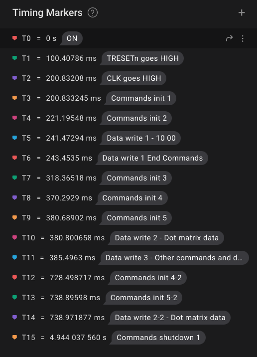

Pseudocode:
```
sleep_ms(100)
##
set_pin(TRESETn, HIGH)
send_spi_cmds('88888860E33A2F34B1436C92A1B22208')
sleep_ms(20)
##
send_spi_cmds('5040')
sleep_ms(20)
##
send_spi_cmds('1000')
send_spi_data('000000000000000000000000000000000000000000000000000000000000000000000000000000000000000000000000000000000000000000000000000000000000000000000000000000000000000000000000000000000000000000000000000000000000000000000000000000000000000000000000000000000000000000000000000000000000000000000000000000000000000000000000000000000000000000000000000000000000000000000000000000000000000000000000000000000000000000000000000000000000000000000000000000000000000000000000000000000000000000000000000000000000000000000000000000000000000000000000000000000000000000000000000000000000000000000000000000000000000000000000000000000000000000000000000000000000000000000000')
send_spi_cmds('1000')
sleep_ms(75)
##
send_spi_cmds('B143')
sleep_ms(52)
##
while running:
	send_spi_cmds('8888888860E33A2F34B1436C92A1B22208')
	sleep_ms(10)
	##
	send_spi_cmds('50403D')
	sleep_ms(100)
	##
	send_spi_cmds('1001C0')
	dotmat_data = 'F00000000000000000000000000000000000080000000000000000000000000000000000080000000000000000000000000000000000240000000000000000000000000000000000240000000000000000000000000000000000E20000000000000000000000000000000000220000000000000000000000000000000000220000000000000000000000000000000000220000000000000000000000000000000000220000000000000000000000000000000000240000000000000000000000000000000000240000000000000000000000000000000000080000000000000000000000000000000000080000000000000000000000000000000000F0000000000000000000000000000000000000FF00000000000000000000000000000000'
	send_spi_data(dotmat_data)
	send_spi_cmds('1101C0');send_spi_data('00')
	send_spi_cmds('1101C2');send_spi_data('00')
	send_spi_cmds('1101C4');send_spi_data('00')
	send_spi_cmds('1101C4');send_spi_data('00')
	send_spi_cmds('1101C3');send_spi_data('00')
	send_spi_cmds('1101C6');send_spi_data('00')
	send_spi_cmds('1101C8');send_spi_data('00')
	send_spi_cmds('1101CC');send_spi_data('00')
	send_spi_cmds('1101CE');send_spi_data('20')
	send_spi_cmds('1101CF');send_spi_data('04')
	send_spi_cmds('1101CF');send_spi_data('04')
	send_spi_cmds('1101CF');send_spi_data('04')
	send_spi_cmds('1101CA');send_spi_data('00')
	send_spi_cmds('1101CA');send_spi_data('00')
	send_spi_cmds('1101CA');send_spi_data('00')
	send_spi_cmds('1101CA');send_spi_data('00')
	send_spi_cmds('1101CA');send_spi_data('00')
	send_spi_cmds('1101CA');send_spi_data('00')
	send_spi_cmds('1101CA');send_spi_data('00')
	send_spi_cmds('1101CB');send_spi_data('00')
	send_spi_cmds('1101CB');send_spi_data('00')
	send_spi_cmds('1101CC');send_spi_data('00')
	send_spi_cmds('1101CC');send_spi_data('80')
	send_spi_cmds('1101CC');send_spi_data('80')
	send_spi_cmds('1101CB');send_spi_data('00')
	send_spi_cmds('1101CC');send_spi_data('80')
	send_spi_cmds('1101CD');send_spi_data('00')
	send_spi_cmds('1101CD');send_spi_data('00')
	send_spi_cmds('1101CD');send_spi_data('00')
	send_spi_cmds('1101CD');send_spi_data('02')
	send_spi_cmds('1101CE');send_spi_data('20')
	send_spi_cmds('1101CD');send_spi_data('02')
	send_spi_cmds('1101CE');send_spi_data('20')
	send_spi_cmds('1101CE');send_spi_data('20')
	send_spi_cmds('1101CE');send_spi_data('20')
	send_spi_cmds('1101CF');send_spi_data('04')
	send_spi_cmds('1101CE');send_spi_data('21')
	send_spi_cmds('1101CF');send_spi_data('04')
	send_spi_cmds('1101CE');send_spi_data('21')
	send_spi_cmds('1101CF');send_spi_data('04')
	send_spi_cmds('1000C3');send_spi_data('00')
	send_spi_cmds('1000C1');send_spi_data('00')
	send_spi_cmds('1000C0');send_spi_data('02')
	send_spi_cmds('1000C8');send_spi_data('00')
	send_spi_cmds('1000C6');send_spi_data('00')
	send_spi_cmds('1000C5');send_spi_data('20')
	send_spi_cmds('1000CA');send_spi_data('00')
	send_spi_cmds('1000CB');send_spi_data('00')
	send_spi_cmds('1000CD');send_spi_data('00')
	send_spi_cmds('1000CE');send_spi_data('00')
	send_spi_cmds('1000CF');send_spi_data('00')
	send_spi_cmds('1000C0');send_spi_data('02')
	send_spi_cmds('1000CF');send_spi_data('00')
	send_spi_cmds('1000C5');send_spi_data('60')
	sleep_ms(340)

# Shutdown
send_spi_cmds('39')
sleep_ms(1)
shutdown()
```


## Miscellany

- There are some interesting ways to drive LCDs. See for example [this driver](https://ww1.microchip.com/downloads/en/AppNotes/doc2530.pdf). 
	- Here's a [cool writeup](https://sudhir.nl/lcd?al=projects) for a similar device driver from Sudhir Chandra
- This is [an interesting analysis](https://stackoverflow.com/questions/78168288/reverse-engineer-lcd-protocol-used-in-mpc2000xl) of a protocol for an LCD


### Similar Displays

Here are other SPI displays with similar appearance.

- [Sitronix ST7565 driver chip](https://www.hpinfotech.ro/ST7565.pdf)
	- [Display Visions DOGM132 GRAPHIC display](https://www.lcd-module.de/eng/pdf/grafik/dogm132-5e.pdf), some of their displays use 6.4V backlight like mine
	- [Newhaven Display 128x64 pixel display, model A1Z](https://newhavendisplay.com/content/specs/NHD-C12864A1Z-FSW-FBW-HTT.pdf)
	- [Focus LCDs G132ALGFGSB6WTCCXAL](https://focuslcds.com/wp-content/uploads/Specs/G132ALGFGSB6WTCCXAL_Spec.pdf)
